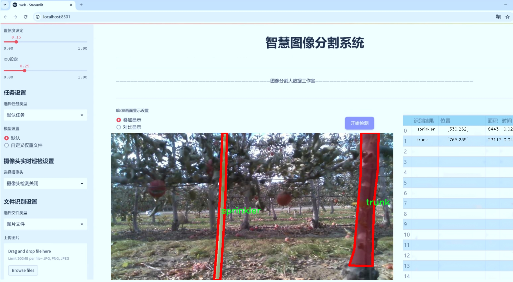
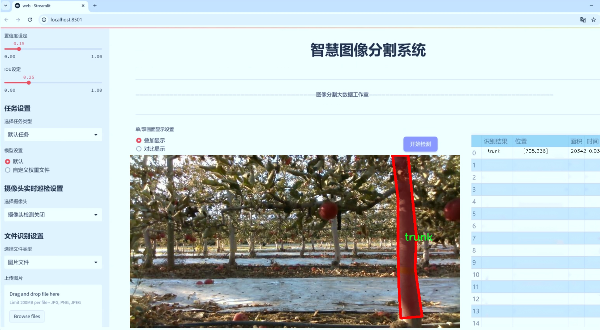
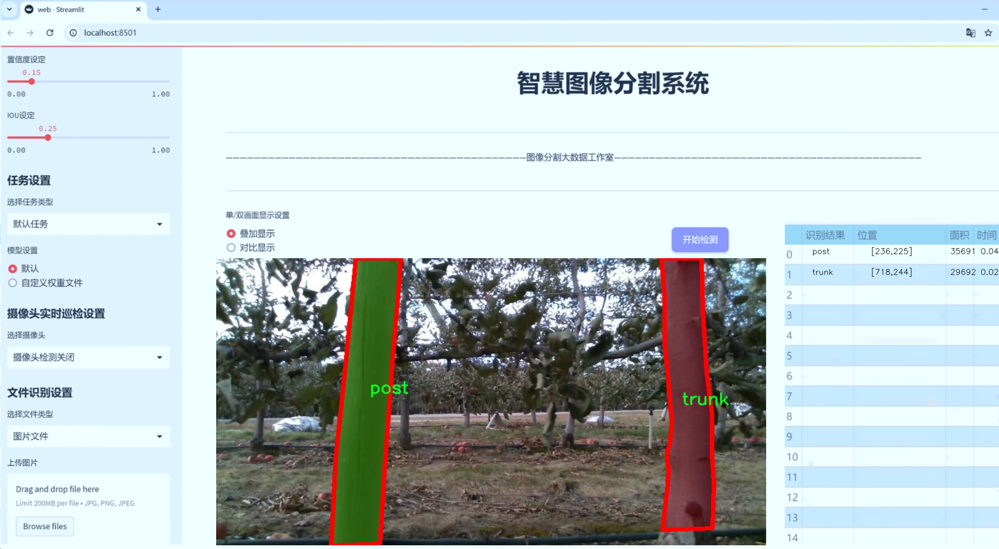
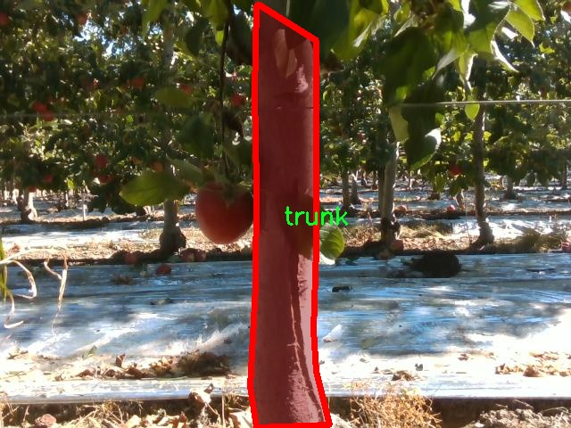
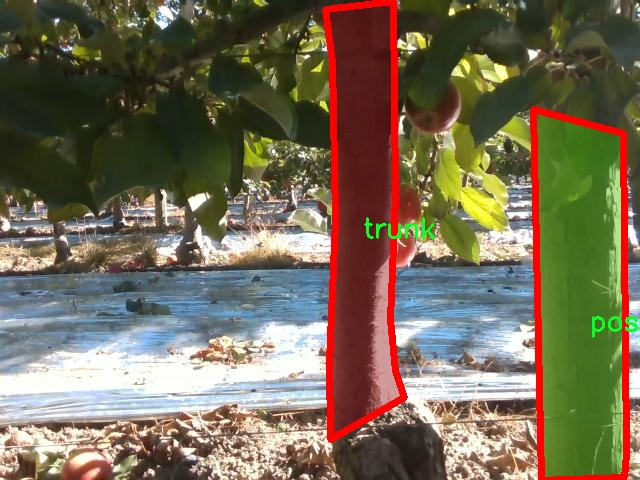
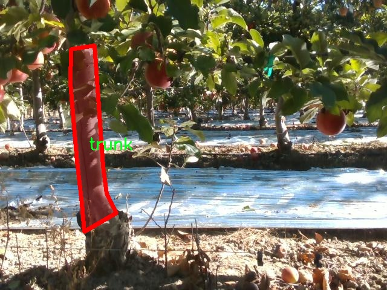
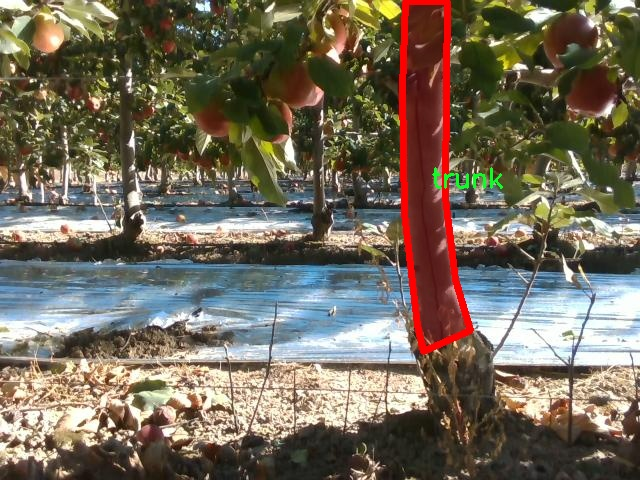
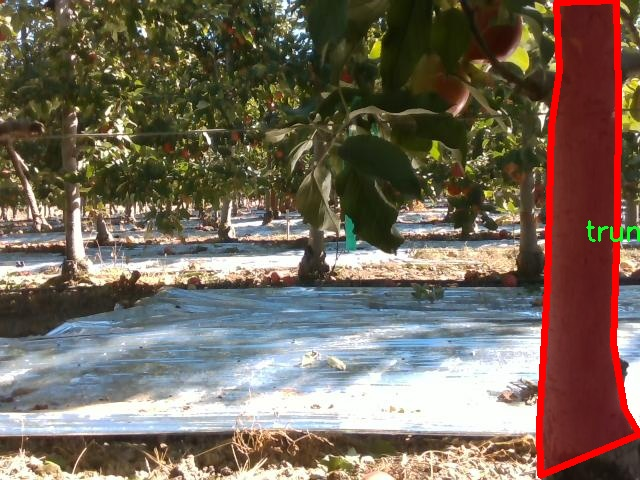

# 路旁树干检测计数图像分割系统： yolov8-seg-RCSOSA

### 1.研究背景与意义

[参考博客](https://gitee.com/YOLOv8_YOLOv11_Segmentation_Studio/projects)

[博客来源](https://kdocs.cn/l/cszuIiCKVNis)

研究背景与意义

随着城市化进程的加快，城市绿化的重要性日益凸显，树木作为城市生态系统的重要组成部分，不仅美化了城市环境，还在调节气候、改善空气质量、提供栖息地等方面发挥着不可替代的作用。然而，随着城市发展和人类活动的增加，树木的生长环境受到严重威胁，树木的数量和健康状况亟需进行有效监测与管理。因此，开发一套高效的树干检测与计数系统显得尤为重要。传统的人工巡查方法不仅耗时耗力，而且容易受到人为因素的影响，难以保证数据的准确性和及时性。因此，基于计算机视觉技术的自动化检测系统应运而生。

在众多计算机视觉技术中，YOLO（You Only Look Once）系列模型因其实时性和高精度的特点，广泛应用于物体检测领域。YOLOv8作为该系列的最新版本，进一步提升了检测精度和速度，适合于复杂环境下的目标检测任务。然而，针对特定应用场景，如路旁树干的检测与计数，YOLOv8仍然存在一些不足之处。例如，在树干与其他物体（如喷头、路标等）密集分布的环境中，模型可能会出现误检或漏检现象。因此，改进YOLOv8以适应树干检测的特定需求，成为了本研究的主要目标。

本研究将基于改进的YOLOv8模型，构建一个路旁树干检测计数图像分割系统。该系统不仅能够准确识别树干，还能有效区分与树干相似的其他物体，如喷头和路标等，从而实现对树木数量的精准统计。为此，我们将利用包含1100幅图像的数据集，数据集中涵盖了三类目标：树干、喷头和路标。这一数据集的多样性和丰富性为模型的训练和验证提供了良好的基础，能够有效提升模型的泛化能力和鲁棒性。

此外，树干检测的准确性不仅关乎城市绿化的管理与维护，还对生态环境的保护、城市规划的科学性具有重要意义。通过自动化的树干检测与计数系统，城市管理者可以实时获取树木的生长状况和分布情况，从而制定更为合理的绿化方案，提升城市生态环境的可持续性。同时，该系统的推广应用也将为其他领域的物体检测提供借鉴，推动计算机视觉技术在生态环境监测中的广泛应用。

综上所述，基于改进YOLOv8的路旁树干检测计数图像分割系统的研究，不仅具有重要的理论意义，还具备广泛的实际应用价值。通过该系统的实现，我们期望能够为城市绿化管理提供一种高效、准确的技术手段，助力于城市生态环境的可持续发展。

### 2.图片演示







注意：本项目提供完整的训练源码数据集和训练教程,由于此博客编辑较早,暂不提供权重文件（best.pt）,需要按照6.训练教程进行训练后实现上图效果。

### 3.视频演示

[3.1 视频演示](https://www.bilibili.com/video/BV1HAmRYjEFW/)

### 4.数据集信息

##### 4.1 数据集类别数＆类别名

nc: 3
names: ['post', 'sprinkler', 'trunk']


##### 4.2 数据集信息简介

数据集信息展示

在现代计算机视觉领域，尤其是在物体检测和图像分割任务中，数据集的构建与选择至关重要。本研究所使用的数据集名为“Tree Trunk Detection”，专门用于训练和改进YOLOv8-seg模型，以实现对路旁树干的精准检测与计数。该数据集的设计旨在提供丰富的样本，以支持模型在实际应用中的表现，尤其是在复杂环境下的鲁棒性和准确性。

“Tree Trunk Detection”数据集包含三种主要类别，分别为“post”（路灯杆）、“sprinkler”（喷头）和“trunk”（树干）。这些类别的选择反映了在城市环境中常见的物体，尤其是与绿化和城市基础设施相关的元素。通过对这些类别的细致标注，数据集为模型提供了多样化的训练样本，使其能够在不同场景中有效地识别和分割目标物体。

在数据集的构建过程中，特别注重样本的多样性和代表性。数据集中的图像来源于不同的城市环境，包括公园、街道和居民区等，确保模型能够适应各种光照条件、天气变化和视角差异。这种多样性不仅提高了模型的泛化能力，也使得其在实际应用中能够更好地应对不同的挑战。

为了增强数据集的有效性，所有图像均经过精确的标注，确保每个类别的物体都被准确地框定和分割。这种细致的标注过程是训练高性能模型的基础，因为它直接影响到模型学习的质量和效果。此外，数据集还包含了不同尺寸和形状的物体，以帮助模型学习到更加丰富的特征表示。

在训练过程中，YOLOv8-seg模型将利用这些标注良好的图像进行学习，旨在提升其在树干检测和计数任务中的性能。通过使用该数据集，模型不仅能够识别出树干，还能有效区分与之相邻的其他物体，如路灯杆和喷头。这种能力在城市管理、环境监测以及绿化管理等领域具有重要的应用价值。

值得一提的是，数据集的设计也考虑到了未来的扩展性。随着更多数据的收集和标注，未来可以进一步丰富类别和样本，以应对更复杂的场景和任务。这种灵活性为研究人员和开发者提供了良好的基础，使他们能够不断优化和改进模型，推动树干检测技术的发展。

综上所述，“Tree Trunk Detection”数据集为改进YOLOv8-seg模型提供了一个高质量的训练基础。通过对三种类别的深入分析和多样化样本的构建，该数据集不仅为模型的训练提供了必要的数据支持，也为未来的研究和应用奠定了坚实的基础。随着技术的不断进步，期待该数据集能够在实际应用中发挥更大的作用，助力城市环境的智能化管理。











### 5.项目依赖环境部署教程（零基础手把手教学）

[5.1 环境部署教程链接（零基础手把手教学）](https://www.bilibili.com/video/BV1jG4Ve4E9t/?vd_source=bc9aec86d164b67a7004b996143742dc)


[5.2 安装Python虚拟环境创建和依赖库安装视频教程链接（零基础手把手教学）](https://www.bilibili.com/video/BV1nA4VeYEze/?vd_source=bc9aec86d164b67a7004b996143742dc)

### 6.手把手YOLOV8-seg训练视频教程（零基础手把手教学）

[6.1 手把手YOLOV8-seg训练视频教程（零基础小白有手就能学会）](https://www.bilibili.com/video/BV1cA4VeYETe/?vd_source=bc9aec86d164b67a7004b996143742dc)


按照上面的训练视频教程链接加载项目提供的数据集，运行train.py即可开始训练



     Epoch   gpu_mem       box       obj       cls    labels  img_size
     1/200     0G   0.01576   0.01955  0.007536        22      1280: 100%|██████████| 849/849 [14:42<00:00,  1.04s/it]
               Class     Images     Labels          P          R     mAP@.5 mAP@.5:.95: 100%|██████████| 213/213 [01:14<00:00,  2.87it/s]
                 all       3395      17314      0.994      0.957      0.0957      0.0843

     Epoch   gpu_mem       box       obj       cls    labels  img_size
     2/200     0G   0.01578   0.01923  0.007006        22      1280: 100%|██████████| 849/849 [14:44<00:00,  1.04s/it]
               Class     Images     Labels          P          R     mAP@.5 mAP@.5:.95: 100%|██████████| 213/213 [01:12<00:00,  2.95it/s]
                 all       3395      17314      0.996      0.956      0.0957      0.0845

     Epoch   gpu_mem       box       obj       cls    labels  img_size
     3/200     0G   0.01561    0.0191  0.006895        27      1280: 100%|██████████| 849/849 [10:56<00:00,  1.29it/s]
               Class     Images     Labels          P          R     mAP@.5 mAP@.5:.95: 100%|███████   | 187/213 [00:52<00:00,  4.04it/s]
                 all       3395      17314      0.996      0.957      0.0957      0.0845


### 7.50+种全套YOLOV8-seg创新点加载调参实验视频教程（一键加载写好的改进模型的配置文件）

[7.1 50+种全套YOLOV8-seg创新点加载调参实验视频教程（一键加载写好的改进模型的配置文件）](https://www.bilibili.com/video/BV1Hw4VePEXv/?vd_source=bc9aec86d164b67a7004b996143742dc)

### YOLOV8-seg算法简介

原始YOLOv8-seg算法原理

YOLOv8-seg算法是Ultralytics公司在2023年推出的一个重要版本，代表了YOLO系列目标检测和图像分割技术的又一次飞跃。该算法不仅在目标检测领域表现出色，还在图像分割任务中展现了强大的能力。YOLOv8-seg的设计理念基于快速、准确和易于使用的原则，使其成为各种计算机视觉任务的理想选择。通过引入新的网络结构和优化策略，YOLOv8-seg在处理复杂场景时展现了更高的灵活性和性能。

首先，YOLOv8-seg的输入部分设计为支持640x640的标准图像尺寸，然而在实际应用中，图像的长宽比往往各不相同。为了解决这一问题，YOLOv8-seg采用了自适应图像缩放技术。在模型推理阶段，算法将长边按比例缩小至指定尺寸，然后对短边进行填充。这种方法不仅减少了填充带来的信息冗余，还提高了目标检测和推理的速度。此外，在训练过程中，YOLOv8-seg引入了Mosaic图像增强技术。该技术通过随机选择四张图像进行缩放和拼接，生成新的训练样本，迫使模型学习不同位置和周围像素的特征，从而有效提升了模型的预测精度和整体性能。

在网络结构方面，YOLOv8-seg的主干网络（Backbone）进行了显著改进。相较于YOLOv5中的C3模块，YOLOv8-seg采用了C2F模块，该模块灵感来源于YOLOv7中的ELAN设计。C2F模块通过增加并行的梯度流分支，能够在保持轻量化的同时获取更丰富的梯度信息。这种设计使得YOLOv8-seg在处理不同规模的目标时，能够更加灵活地适应各种场景，进而提高了检测精度。

在特征融合部分，YOLOv8-seg的Neck结构也进行了优化。与YOLOv5相比，YOLOv8-seg去除了多余的上采样卷积层，直接对Backbone不同阶段输出的特征进行上采样。这种简化的结构不仅提高了计算效率，还减少了模型的复杂性，使得YOLOv8-seg在实际应用中能够更快地进行推理。

YOLOv8-seg的Head部分是其最大的创新之一。该部分采用了解耦合头结构，将目标检测和分类任务分开处理。这一设计使得每个任务都能专注于自身的特征提取，进而提高了模型的整体性能。此外，YOLOv8-seg摒弃了传统的Anchor-Based方法，转而采用Anchor-Free的策略。这一转变使得模型不再依赖于预设的锚框，从而简化了训练过程并提高了泛化能力。通过将目标检测转化为关键点检测，YOLOv8-seg能够更灵活地适应不同类型的目标，尤其是在处理形状和大小差异较大的物体时，表现得尤为出色。

在损失函数的设计上，YOLOv8-seg同样进行了创新。分类损失采用了二元交叉熵损失（BCELoss），而边界框回归损失则结合了分布焦点损失（DFL）和CIoU损失。这种组合损失函数的设计旨在使模型能够快速聚焦于标签附近的数值，提高了预测的准确性。通过这种方式，YOLOv8-seg能够更有效地处理复杂场景中的目标检测和分割任务。

综上所述，YOLOv8-seg算法通过一系列创新的设计和优化策略，在目标检测和图像分割领域实现了显著的性能提升。其自适应图像缩放、改进的主干网络、简化的特征融合结构以及解耦合的头部设计，使得YOLOv8-seg在处理多样化的视觉任务时，展现出更高的灵活性和准确性。这些特性使得YOLOv8-seg不仅适用于传统的目标检测任务，还能够在复杂的图像分割场景中发挥重要作用，成为计算机视觉领域的一项重要工具。


### 9.系统功能展示（检测对象为举例，实际内容以本项目数据集为准）

图9.1.系统支持检测结果表格显示

  图9.2.系统支持置信度和IOU阈值手动调节

  图9.3.系统支持自定义加载权重文件best.pt(需要你通过步骤5中训练获得)

  图9.4.系统支持摄像头实时识别

  图9.5.系统支持图片识别

  图9.6.系统支持视频识别

  图9.7.系统支持识别结果文件自动保存

  图9.8.系统支持Excel导出检测结果数据


### 10.50+种全套YOLOV8-seg创新点原理讲解（非科班也可以轻松写刊发刊，V11版本正在科研待更新）

#### 10.1 由于篇幅限制，每个创新点的具体原理讲解就不一一展开，具体见下列网址中的创新点对应子项目的技术原理博客网址【Blog】：


[10.1 50+种全套YOLOV8-seg创新点原理讲解链接](https://gitee.com/qunmasj/good)

#### 10.2 部分改进模块原理讲解(完整的改进原理见上图和技术博客链接)【如果此小节的图加载失败可以通过CSDN或者Github搜索该博客的标题访问原始博客，原始博客图片显示正常】
### YOLOv8简介

YOLOv8 是 Ultralytics 公司继 YOLOv5 算法之后开发的下一代算法模型，目前支持图像分类、物体检测和实例分割任务。YOLOv8 是一个 SOTA 模型，它建立在之前YOLO 系列模型的成功基础上，并引入了新的功能和改进，以进一步提升性能和灵活性。具体创新包括：一个新的骨干网络、一个新的 Ancher-Free 检测头和一个新的损失函数，可以在从 CPU 到 GPU 的各种硬件平台上运行。注意到ultralytics 并没有直接将开源库命名为 YOLOv8，而是直接使用 Ultralytics这个单词，原因是Ultralytics这个库的定位是算法框架，而非特指某一个特定算法，其希望这个库不仅仅能够用于 YOLO 系列模型，同时也能支持其他的视觉任务如图像分类、实例分割等。下图画图YOLOv8目标检测算法同其他YOLO系列算法（YOLOv5、6、7）的实验对比图，左边是模型参数量对比，右边是速度对比。


下面两个表分别是YOLOv8和YOLOv5（v7.0版本）官方在 COCO Val 2017 数据集上测试结果，从中看出 YOLOv8 相比 YOLOv5 精度提升大，但是 N/S/M 模型相应的参数量、FLOPS等提高了不少。


#### YOLOv8概述
提供了一个全新的SOTA模型，和YOLOv5一样，基于缩放系数也提供了 N/S/M/L/X 尺度的不同大小模型，用于满足不同场景需求，同时支持图像分类、目标检测、实例分割和姿态检测任务
在骨干网络和Neck部分将YOLOv5的C3结构换成了梯度流更丰富的 C2f 结构，并对不同尺度模型调整了不同的通道数，大幅提升了模型性能；需要注意的是C2f 模块中存在Split等操作对特定硬件部署没有之前那么友好


Head部分换成了目前主流的解耦头结构，将分类和检测头分离，同时也从 Anchor-Based换成了Anchor-Free Loss
计算方面采用了 TaskAlignedAssigner 正样本分配策略，并引入了 Distribution Focal Loss
下图画出YOLOv8目标检测算法的整体结构图


#### YOLOv8模型
YOLOv8目标检测算法的模型配置文件如下：


从配置文件可以看出，YOLOv8与YOLOv5模型最明显的差异是使用C2F模块替换了原来的C3模块，两个模块的结构图下图所示。


另外Head 部分变化最大，从原先的耦合头变成了解耦头，并且从 YOLOv5 的 Anchor-Based 变成了 Anchor-Free。其结构对比图如下所示：

### RepViT简介

近年来，与轻量级卷积神经网络(cnn)相比，轻量级视觉变压器(ViTs)在资源受限的移动设备上表现出了更高的性能和更低的延迟。这种改进通常归功于多头自注意模块，它使模型能够学习全局表示。然而，轻量级vit和轻量级cnn之间的架构差异还没有得到充分的研究。在这项研究中，我们重新审视了轻量级cnn的高效设计，并强调了它们在移动设备上的潜力。通过集成轻量级vit的高效架构选择，我们逐步增强了标准轻量级CNN的移动友好性，特别是MobileNetV3。这就产生了一个新的纯轻量级cnn家族，即RepViT。大量的实验表明，RepViT优于现有的轻型vit，并在各种视觉任务中表现出良好的延迟。在ImageNet上，RepViT在iPhone 12上以近1ms的延迟实现了超过80%的top-1精度，据我们所知，这是轻量级模型的第一次。

#### RepViT简介
轻量级模型研究一直是计算机视觉任务中的一个焦点，其目标是在降低计算成本的同时达到优秀的性能。轻量级模型与资源受限的移动设备尤其相关，使得视觉模型的边缘部署成为可能。在过去十年中，研究人员主要关注轻量级卷积神经网络（CNNs）的设计，提出了许多高效的设计原则，包括可分离卷积 、逆瓶颈结构 、通道打乱 和结构重参数化等，产生了 MobileNets ，ShuffleNets和 RepVGG 等代表性模型。

另一方面，视觉 Transformers（ViTs）成为学习视觉表征的另一种高效方案。与 CNNs 相比，ViTs 在各种计算机视觉任务中表现出了更优越的性能。然而，ViT 模型一般尺寸很大，延迟很高，不适合资源受限的移动设备。因此，研究人员开始探索 ViT 的轻量级设计。许多高效的ViTs设计原则被提出，大大提高了移动设备上 ViTs 的计算效率，产生了EfficientFormers ，MobileViTs等代表性模型。这些轻量级 ViTs 在移动设备上展现出了相比 CNNs 的更强的性能和更低的延迟。

轻量级 ViTs 优于轻量级 CNNs 的原因通常归结于多头注意力模块，该模块使模型能够学习全局表征。然而，轻量级 ViTs 和轻量级 CNNs 在块结构、宏观和微观架构设计方面存在值得注意的差异，但这些差异尚未得到充分研究。这自然引出了一个问题：轻量级 ViTs 的架构选择能否提高轻量级 CNN 的性能？在这项工作中，我们结合轻量级 ViTs 的架构选择，重新审视了轻量级 CNNs 的设计。我们的旨在缩小轻量级 CNNs 与轻量级 ViTs 之间的差距，并强调前者与后者相比在移动设备上的应用潜力。


在 ConvNeXt 中，参考该博客提出的基于 ResNet50 架构的基础上通过严谨的理论和实验分析，最终设计出一个非常优异的足以媲美 Swin-Transformer 的纯卷积神经网络架构。同样地，RepViT也是主要通过将轻量级 ViTs 的架构设计逐步整合到标准轻量级 CNN，即MobileNetV3-L，来对其进行针对性地改造（魔改）。在这个过程中，作者们考虑了不同粒度级别的设计元素，并通过一系列步骤达到优化的目标。


详细优化步骤如下：

#### 训练配方的对齐
论文中引入了一种衡量移动设备上延迟的指标，并将训练策略与现有的轻量级 ViTs 对齐。这一步骤主要是为了确保模型训练的一致性，其涉及两个概念，即延迟度量和训练策略的调整。

#### 延迟度量指标
为了更准确地衡量模型在真实移动设备上的性能，作者选择了直接测量模型在设备上的实际延迟，以此作为基准度量。这个度量方法不同于之前的研究，它们主要通过FLOPs或模型大小等指标优化模型的推理速度，这些指标并不总能很好地反映在移动应用中的实际延迟。

#### 训练策略的对齐
这里，将 MobileNetV3-L 的训练策略调整以与其他轻量级 ViTs 模型对齐。这包括使用 AdamW 优化器-ViTs 模型必备的优化器，进行 5 个 epoch 的预热训练，以及使用余弦退火学习率调度进行 300 个 epoch 的训练。尽管这种调整导致了模型准确率的略微下降，但可以保证公平性。

#### 块设计的优化
基于一致的训练设置，作者们探索了最优的块设计。块设计是 CNN 架构中的一个重要组成部分，优化块设计有助于提高网络的性能。

#### 分离 Token 混合器和通道混合器
这块主要是对 MobileNetV3-L 的块结构进行了改进，分离了令牌混合器和通道混合器。原来的 MobileNetV3 块结构包含一个 1x1 扩张卷积，然后是一个深度卷积和一个 1x1 的投影层，然后通过残差连接连接输入和输出。在此基础上，RepViT 将深度卷积提前，使得通道混合器和令牌混合器能够被分开。为了提高性能，还引入了结构重参数化来在训练时为深度滤波器引入多分支拓扑。最终，作者们成功地在 MobileNetV3 块中分离了令牌混合器和通道混合器，并将这种块命名为 RepViT 块。

#### 降低扩张比例并增加宽度
在通道混合器中，原本的扩张比例是 4，这意味着 MLP 块的隐藏维度是输入维度的四倍，消耗了大量的计算资源，对推理时间有很大的影响。为了缓解这个问题，我们可以将扩张比例降低到 2，从而减少了参数冗余和延迟，使得 MobileNetV3-L 的延迟降低到 0.65ms。随后，通过增加网络的宽度，即增加各阶段的通道数量，Top-1 准确率提高到 73.5%，而延迟只增加到 0.89ms！

#### 宏观架构元素的优化
在这一步，本文进一步优化了MobileNetV3-L在移动设备上的性能，主要是从宏观架构元素出发，包括 stem，降采样层，分类器以及整体阶段比例。通过优化这些宏观架构元素，模型的性能可以得到显著提高。

#### 浅层网络使用卷积提取器
ViTs 通常使用一个将输入图像分割成非重叠补丁的 “patchify” 操作作为 stem。然而，这种方法在训练优化性和对训练配方的敏感性上存在问题。因此，作者们采用了早期卷积来代替，这种方法已经被许多轻量级 ViTs 所采纳。对比之下，MobileNetV3-L 使用了一个更复杂的 stem 进行 4x 下采样。这样一来，虽然滤波器的初始数量增加到24，但总的延迟降低到0.86ms，同时 top-1 准确率提高到 73.9%。

#### 更深的下采样层
在 ViTs 中，空间下采样通常通过一个单独的补丁合并层来实现。因此这里我们可以采用一个单独和更深的下采样层，以增加网络深度并减少由于分辨率降低带来的信息损失。具体地，作者们首先使用一个 1x1 卷积来调整通道维度，然后将两个 1x1 卷积的输入和输出通过残差连接，形成一个前馈网络。此外，他们还在前面增加了一个 RepViT 块以进一步加深下采样层，这一步提高了 top-1 准确率到 75.4%，同时延迟为 0.96ms。

#### 更简单的分类器
在轻量级 ViTs 中，分类器通常由一个全局平均池化层后跟一个线性层组成。相比之下，MobileNetV3-L 使用了一个更复杂的分类器。因为现在最后的阶段有更多的通道，所以作者们将它替换为一个简单的分类器，即一个全局平均池化层和一个线性层，这一步将延迟降低到 0.77ms，同时 top-1 准确率为 74.8%。

#### 整体阶段比例
阶段比例代表了不同阶段中块数量的比例，从而表示了计算在各阶段中的分布。论文选择了一个更优的阶段比例 1:1:7:1，然后增加网络深度到 2:2:14:2，从而实现了一个更深的布局。这一步将 top-1 准确率提高到 76.9%，同时延迟为 1.02 ms。

#### 卷积核大小的选择
众所周知，CNNs 的性能和延迟通常受到卷积核大小的影响。例如，为了建模像 MHSA 这样的远距离上下文依赖，ConvNeXt 使用了大卷积核，从而实现了显著的性能提升。然而，大卷积核对于移动设备并不友好，因为它的计算复杂性和内存访问成本。MobileNetV3-L 主要使用 3x3 的卷积，有一部分块中使用 5x5 的卷积。作者们将它们替换为3x3的卷积，这导致延迟降低到 1.00ms，同时保持了76.9%的top-1准确率。

#### SE 层的位置
自注意力模块相对于卷积的一个优点是根据输入调整权重的能力，这被称为数据驱动属性。作为一个通道注意力模块，SE层可以弥补卷积在缺乏数据驱动属性上的限制，从而带来更好的性能。MobileNetV3-L 在某些块中加入了SE层，主要集中在后两个阶段。然而，与分辨率较高的阶段相比，分辨率较低的阶段从SE提供的全局平均池化操作中获得的准确率提升较小。作者们设计了一种策略，在所有阶段以交叉块的方式使用SE层，从而在最小的延迟增量下最大化准确率的提升，这一步将top-1准确率提升到77.4%，同时延迟降低到0.87ms。

注意！【这一点其实百度在很早前就已经做过实验比对得到过这个结论了，SE 层放置在靠近深层的地方效果好】

#### 微观设计的调整
RepViT 通过逐层微观设计来调整轻量级 CNN，这包括选择合适的卷积核大小和优化挤压-激励（Squeeze-and-excitation，简称SE）层的位置。这两种方法都能显著改善模型性能。

#### 网络架构
最终，通过整合上述改进策略，我们便得到了模型RepViT的整体架构，该模型有多个变种，例如RepViT-M1/M2/M3。同样地，不同的变种主要通过每个阶段的通道数和块数来区分。


### 11.项目核心源码讲解（再也不用担心看不懂代码逻辑）

#### 11.1 ultralytics\nn\modules\conv.py

以下是经过简化和注释的核心代码部分，保留了最重要的卷积模块和注意力机制的实现：

```python
import torch
import torch.nn as nn
import math

def autopad(k, p=None, d=1):
    """自动计算填充以保持输出形状与输入相同。"""
    if d > 1:
        k = d * (k - 1) + 1 if isinstance(k, int) else [d * (x - 1) + 1 for x in k]  # 实际卷积核大小
    if p is None:
        p = k // 2 if isinstance(k, int) else [x // 2 for x in k]  # 自动填充
    return p

class Conv(nn.Module):
    """标准卷积层，包含卷积、批归一化和激活函数。"""
    default_act = nn.SiLU()  # 默认激活函数

    def __init__(self, c1, c2, k=1, s=1, p=None, g=1, d=1, act=True):
        """初始化卷积层。"""
        super().__init__()
        self.conv = nn.Conv2d(c1, c2, k, s, autopad(k, p, d), groups=g, dilation=d, bias=False)
        self.bn = nn.BatchNorm2d(c2)  # 批归一化
        self.act = self.default_act if act is True else act if isinstance(act, nn.Module) else nn.Identity()

    def forward(self, x):
        """前向传播：卷积 -> 批归一化 -> 激活函数。"""
        return self.act(self.bn(self.conv(x)))

class ChannelAttention(nn.Module):
    """通道注意力模块。"""
    def __init__(self, channels: int) -> None:
        """初始化通道注意力模块。"""
        super().__init__()
        self.pool = nn.AdaptiveAvgPool2d(1)  # 自适应平均池化
        self.fc = nn.Conv2d(channels, channels, 1, 1, 0, bias=True)  # 1x1卷积
        self.act = nn.Sigmoid()  # Sigmoid激活函数

    def forward(self, x: torch.Tensor) -> torch.Tensor:
        """前向传播：计算通道注意力并加权输入。"""
        return x * self.act(self.fc(self.pool(x)))

class SpatialAttention(nn.Module):
    """空间注意力模块。"""
    def __init__(self, kernel_size=7):
        """初始化空间注意力模块。"""
        super().__init__()
        assert kernel_size in (3, 7), 'kernel size must be 3 or 7'
        padding = 3 if kernel_size == 7 else 1
        self.cv1 = nn.Conv2d(2, 1, kernel_size, padding=padding, bias=False)  # 卷积层
        self.act = nn.Sigmoid()  # Sigmoid激活函数

    def forward(self, x):
        """前向传播：计算空间注意力并加权输入。"""
        return x * self.act(self.cv1(torch.cat([torch.mean(x, 1, keepdim=True), torch.max(x, 1, keepdim=True)[0]], 1)))

class CBAM(nn.Module):
    """卷积块注意力模块。"""
    def __init__(self, c1, kernel_size=7):
        """初始化CBAM模块。"""
        super().__init__()
        self.channel_attention = ChannelAttention(c1)  # 通道注意力
        self.spatial_attention = SpatialAttention(kernel_size)  # 空间注意力

    def forward(self, x):
        """前向传播：依次应用通道和空间注意力。"""
        return self.spatial_attention(self.channel_attention(x))
```

### 代码说明：
1. **`autopad` 函数**：用于自动计算卷积操作的填充，使得输出的形状与输入相同。
2. **`Conv` 类**：实现了标准的卷积层，包含卷积操作、批归一化和激活函数的组合。
3. **`ChannelAttention` 类**：实现了通道注意力机制，通过自适应平均池化和1x1卷积来计算通道权重。
4. **`SpatialAttention` 类**：实现了空间注意力机制，通过对输入的平均和最大值进行卷积来计算空间权重。
5. **`CBAM` 类**：结合了通道注意力和空间注意力的模块，依次应用这两种注意力机制来增强特征表示。

以上代码展示了卷积神经网络中常用的卷积和注意力机制的实现方式，适用于各种计算机视觉任务。

该文件是Ultralytics YOLO项目中的一个模块，主要实现了各种卷积层的定义和相关功能。首先，文件引入了必要的库，包括数学库、NumPy和PyTorch。接着，定义了一个名为`autopad`的函数，用于自动计算卷积操作的填充，以确保输出形状与输入形状相同。

接下来，定义了多个卷积类，主要包括`Conv`、`Conv2`、`LightConv`、`DWConv`等。`Conv`类实现了标准的卷积操作，包含卷积层、批归一化层和激活函数。在初始化时，可以指定输入通道数、输出通道数、卷积核大小、步幅、填充、分组和扩张等参数。`forward`方法实现了前向传播过程，依次应用卷积、批归一化和激活函数。

`Conv2`类是对`Conv`类的简化实现，增加了一个1x1的卷积层，用于提升模型的表达能力。它的`forward`方法将两个卷积的输出相加后再经过激活函数。

`LightConv`类实现了一种轻量级卷积结构，主要由两个卷积层组成，分别是1x1卷积和深度卷积。`DWConv`类则实现了深度卷积，主要用于减少参数量和计算量。

`ConvTranspose`类实现了转置卷积操作，通常用于上采样过程。`Focus`类用于将输入的空间信息聚合到通道维度，提升特征表达能力。

`GhostConv`类实现了Ghost卷积，旨在通过较少的参数实现更高的性能。`RepConv`类则是一个基本的重复卷积模块，支持训练和推理状态的切换。

此外，文件中还定义了几个注意力机制模块，包括`ChannelAttention`、`SpatialAttention`和`CBAM`。这些模块通过对特征图的通道和空间维度进行加权，提升了模型对重要特征的关注。

最后，`Concat`类用于在指定维度上连接多个张量，常用于在YOLO模型中合并不同层的特征图。整体来看，该文件实现了多种卷积操作和注意力机制，为YOLO模型的构建提供了基础组件。

#### 11.2 ultralytics\utils\callbacks\tensorboard.py

以下是代码中最核心的部分，并附上详细的中文注释：

```python
# 导入必要的库
from ultralytics.utils import LOGGER, SETTINGS, TESTS_RUNNING, colorstr

try:
    # 尝试导入TensorBoard的SummaryWriter
    from torch.utils.tensorboard import SummaryWriter

    # 确保当前不是在测试环境中运行
    assert not TESTS_RUNNING  
    # 确保TensorBoard集成已启用
    assert SETTINGS['tensorboard'] is True  
    WRITER = None  # 初始化TensorBoard的SummaryWriter实例

except (ImportError, AssertionError, TypeError):
    # 处理导入错误或断言错误
    SummaryWriter = None  # 如果导入失败，则将SummaryWriter设置为None


def _log_scalars(scalars, step=0):
    """将标量值记录到TensorBoard中。"""
    if WRITER:  # 如果WRITER已初始化
        for k, v in scalars.items():  # 遍历标量字典
            WRITER.add_scalar(k, v, step)  # 记录每个标量


def _log_tensorboard_graph(trainer):
    """将模型图记录到TensorBoard中。"""
    try:
        import warnings
        from ultralytics.utils.torch_utils import de_parallel, torch

        imgsz = trainer.args.imgsz  # 获取输入图像的大小
        imgsz = (imgsz, imgsz) if isinstance(imgsz, int) else imgsz  # 确保图像大小为元组
        p = next(trainer.model.parameters())  # 获取模型参数以确定设备和类型
        im = torch.zeros((1, 3, *imgsz), device=p.device, dtype=p.dtype)  # 创建一个零填充的输入图像
        with warnings.catch_warnings():
            warnings.simplefilter('ignore', category=UserWarning)  # 忽略JIT跟踪警告
            WRITER.add_graph(torch.jit.trace(de_parallel(trainer.model), im, strict=False), [])  # 记录模型图
    except Exception as e:
        LOGGER.warning(f'WARNING ⚠️ TensorBoard图形可视化失败 {e}')  # 记录警告信息


def on_pretrain_routine_start(trainer):
    """初始化TensorBoard记录。"""
    if SummaryWriter:  # 如果SummaryWriter可用
        try:
            global WRITER  # 声明WRITER为全局变量
            WRITER = SummaryWriter(str(trainer.save_dir))  # 创建SummaryWriter实例
            prefix = colorstr('TensorBoard: ')
            LOGGER.info(f"{prefix}开始使用 'tensorboard --logdir {trainer.save_dir}'，可在 http://localhost:6006/ 查看。")
        except Exception as e:
            LOGGER.warning(f'WARNING ⚠️ TensorBoard未正确初始化，未记录此运行。 {e}')  # 记录警告信息


def on_train_start(trainer):
    """记录TensorBoard图形。"""
    if WRITER:  # 如果WRITER已初始化
        _log_tensorboard_graph(trainer)  # 记录模型图


def on_batch_end(trainer):
    """在训练批次结束时记录标量统计信息。"""
    _log_scalars(trainer.label_loss_items(trainer.tloss, prefix='train'), trainer.epoch + 1)  # 记录训练损失


def on_fit_epoch_end(trainer):
    """在训练周期结束时记录周期指标。"""
    _log_scalars(trainer.metrics, trainer.epoch + 1)  # 记录训练指标


# 定义回调函数字典，根据SummaryWriter是否可用来决定是否初始化
callbacks = {
    'on_pretrain_routine_start': on_pretrain_routine_start,
    'on_train_start': on_train_start,
    'on_fit_epoch_end': on_fit_epoch_end,
    'on_batch_end': on_batch_end} if SummaryWriter else {}
```

### 代码核心部分解释：
1. **导入库**：导入必要的库和模块，确保可以使用TensorBoard进行日志记录。
2. **异常处理**：在导入`SummaryWriter`时进行异常处理，以防止在不支持TensorBoard的环境中出错。
3. **记录标量**：`_log_scalars`函数用于将训练过程中计算的标量值（如损失）记录到TensorBoard。
4. **记录模型图**：`_log_tensorboard_graph`函数用于将模型的计算图记录到TensorBoard，以便可视化模型结构。
5. **回调函数**：定义了一系列回调函数，在训练的不同阶段（如开始训练、每个批次结束、每个周期结束）进行相应的日志记录。

这个程序文件是用于集成TensorBoard的回调函数，主要用于在训练YOLO模型时记录和可视化训练过程中的各种指标。文件中首先导入了一些必要的模块和库，包括Ultralytics的日志记录器、设置和TensorBoard的SummaryWriter。通过try-except结构，程序尝试导入TensorBoard的SummaryWriter，并进行一些基本的检查，比如确保不是在测试环境中运行，并且TensorBoard集成是启用的。如果导入失败，SummaryWriter将被设置为None。

接下来，定义了几个函数。`_log_scalars`函数用于将标量值记录到TensorBoard中。它接受一个字典形式的标量值和当前步骤作为参数，并将这些值添加到TensorBoard中。

`_log_tensorboard_graph`函数用于将模型的计算图记录到TensorBoard。它首先获取输入图像的尺寸，然后创建一个全零的输入张量，并使用torch.jit.trace来追踪模型的计算图。该函数还处理了一些警告，以避免在记录图时出现不必要的警告信息。

`on_pretrain_routine_start`函数在训练开始前初始化TensorBoard的记录器。如果SummaryWriter可用，它会创建一个新的SummaryWriter实例，并记录下TensorBoard的启动信息，包括如何在本地查看TensorBoard。

`on_train_start`函数在训练开始时调用，用于记录模型的计算图。

`on_batch_end`函数在每个训练批次结束时调用，记录当前批次的标量统计信息。

`on_fit_epoch_end`函数在每个训练周期结束时调用，记录该周期的指标。

最后，程序定义了一个回调字典`callbacks`，其中包含了上述定义的回调函数，如果SummaryWriter不可用，则该字典为空。这个字典的作用是将回调函数与训练过程中的特定事件关联起来，以便在相应的时刻自动调用这些函数进行记录。

#### 11.3 ultralytics\utils\errors.py

```python
# 导入ultralytics.utils模块中的emojis函数，用于处理消息中的表情符号
from ultralytics.utils import emojis

# 自定义异常类，用于处理与Ultralytics YOLO模型获取相关的错误
class HUBModelError(Exception):
    """
    自定义异常类，用于处理Ultralytics YOLO中与模型获取相关的错误。

    当请求的模型未找到或无法检索时，将引发此异常。
    消息也经过处理，以包含表情符号，从而改善用户体验。

    属性：
        message (str): 当异常被引发时显示的错误消息。

    注意：
        消息会通过'ultralytics.utils'包中的'emojis'函数自动处理。
    """

    def __init__(self, message='Model not found. Please check model URL and try again.'):
        """当模型未找到时创建异常。"""
        # 调用父类的构造函数，并将处理过的消息传递给它
        super().__init__(emojis(message))
``` 

### 代码核心部分说明：
1. **异常类定义**：`HUBModelError`类继承自Python内置的`Exception`类，用于创建自定义异常，便于在模型获取失败时提供更明确的错误信息。
2. **构造函数**：`__init__`方法接受一个可选的消息参数，默认消息为“模型未找到，请检查模型URL并重试”。这个消息在创建异常时会被处理，添加表情符号，以提升用户体验。
3. **emojis函数**：用于将消息中的文本转换为包含表情符号的格式，使得错误提示更加生动和友好。

这个程序文件是Ultralytics YOLO库中的一个错误处理模块，主要定义了一个自定义异常类`HUBModelError`。该类用于处理与模型获取相关的错误，特别是在请求的模型未找到或无法检索时会被触发。

在类的文档字符串中，详细说明了这个异常的用途和特性。它会在模型无法找到时被抛出，并且异常消息会经过`ultralytics.utils`包中的`emojis`函数处理，以增强用户体验，使得错误提示更加生动和友好。

类的构造函数`__init__`定义了一个默认的错误消息，即“Model not found. Please check model URL and try again.”，这意味着如果没有提供具体的错误消息，系统会使用这个默认消息。当异常被实例化时，调用父类的构造函数，并将处理过的消息传递给它。

总的来说，这个文件的主要功能是提供一个清晰且用户友好的方式来处理与模型相关的错误，确保在出现问题时，用户能够得到明确的反馈。

#### 11.4 ultralytics\models\yolo\segment\val.py

以下是代码中最核心的部分，并附上详细的中文注释：

```python
class SegmentationValidator(DetectionValidator):
    """
    SegmentationValidator类，继承自DetectionValidator类，用于基于分割模型的验证。
    """

    def __init__(self, dataloader=None, save_dir=None, pbar=None, args=None, _callbacks=None):
        """初始化SegmentationValidator，设置任务为'segment'，并初始化评估指标。"""
        super().__init__(dataloader, save_dir, pbar, args, _callbacks)
        self.plot_masks = None  # 用于存储绘制的掩膜
        self.process = None  # 处理掩膜的函数
        self.args.task = 'segment'  # 设置任务类型为分割
        self.metrics = SegmentMetrics(save_dir=self.save_dir, on_plot=self.on_plot)  # 初始化分割指标

    def preprocess(self, batch):
        """预处理批次数据，将掩膜转换为浮点型并发送到设备。"""
        batch = super().preprocess(batch)  # 调用父类的预处理方法
        batch['masks'] = batch['masks'].to(self.device).float()  # 将掩膜转移到设备并转换为浮点型
        return batch

    def postprocess(self, preds):
        """后处理YOLO预测，返回输出检测结果和原型。"""
        p = ops.non_max_suppression(preds[0],  # 进行非极大值抑制
                                    self.args.conf,
                                    self.args.iou,
                                    labels=self.lb,
                                    multi_label=True,
                                    agnostic=self.args.single_cls,
                                    max_det=self.args.max_det,
                                    nc=self.nc)
        proto = preds[1][-1] if len(preds[1]) == 3 else preds[1]  # 获取原型
        return p, proto  # 返回处理后的预测结果和原型

    def update_metrics(self, preds, batch):
        """更新评估指标。"""
        for si, (pred, proto) in enumerate(zip(preds[0], preds[1])):  # 遍历每个预测和原型
            idx = batch['batch_idx'] == si  # 获取当前批次的索引
            cls = batch['cls'][idx]  # 获取当前批次的类别
            bbox = batch['bboxes'][idx]  # 获取当前批次的边界框
            nl, npr = cls.shape[0], pred.shape[0]  # 标签数量和预测数量
            shape = batch['ori_shape'][si]  # 获取原始图像的形状
            correct_masks = torch.zeros(npr, self.niou, dtype=torch.bool, device=self.device)  # 初始化正确掩膜
            correct_bboxes = torch.zeros(npr, self.niou, dtype=torch.bool, device=self.device)  # 初始化正确边界框
            self.seen += 1  # 更新已处理的样本数量

            if npr == 0:  # 如果没有预测
                if nl:  # 如果有标签
                    self.stats.append((correct_bboxes, correct_masks, *torch.zeros((2, 0), device=self.device), cls.squeeze(-1)))
                continue  # 继续下一个循环

            # 处理掩膜
            midx = [si] if self.args.overlap_mask else idx  # 根据重叠掩膜的参数选择索引
            gt_masks = batch['masks'][midx]  # 获取真实掩膜
            pred_masks = self.process(proto, pred[:, 6:], pred[:, :4], shape=batch['img'][si].shape[1:])  # 处理预测掩膜

            # 处理预测框
            if self.args.single_cls:
                pred[:, 5] = 0  # 如果是单类检测，将类别设置为0
            predn = pred.clone()  # 克隆预测结果
            ops.scale_boxes(batch['img'][si].shape[1:], predn[:, :4], shape, ratio_pad=batch['ratio_pad'][si])  # 将预测框缩放到原始图像大小

            # 评估
            if nl:  # 如果有标签
                height, width = batch['img'].shape[2:]  # 获取图像的高度和宽度
                tbox = ops.xywh2xyxy(bbox) * torch.tensor((width, height, width, height), device=self.device)  # 转换为xyxy格式的目标框
                ops.scale_boxes(batch['img'][si].shape[1:], tbox, shape, ratio_pad=batch['ratio_pad'][si])  # 缩放目标框
                labelsn = torch.cat((cls, tbox), 1)  # 合并类别和目标框
                correct_bboxes = self._process_batch(predn, labelsn)  # 处理边界框
                correct_masks = self._process_batch(predn, labelsn, pred_masks, gt_masks, overlap=self.args.overlap_mask, masks=True)  # 处理掩膜
                if self.args.plots:
                    self.confusion_matrix.process_batch(predn, labelsn)  # 更新混淆矩阵

            # 记录正确的掩膜和边界框
            self.stats.append((correct_bboxes, correct_masks, pred[:, 4], pred[:, 5], cls.squeeze(-1)))

    def finalize_metrics(self, *args, **kwargs):
        """设置评估指标的速度和混淆矩阵。"""
        self.metrics.speed = self.speed  # 设置速度
        self.metrics.confusion_matrix = self.confusion_matrix  # 设置混淆矩阵

    def _process_batch(self, detections, labels, pred_masks=None, gt_masks=None, overlap=False, masks=False):
        """
        返回正确的预测矩阵。

        参数:
            detections (array[N, 6]), x1, y1, x2, y2, conf, class
            labels (array[M, 5]), class, x1, y1, x2, y2

        返回:
            correct (array[N, 10]), 对于10个IoU水平
        """
        if masks:  # 如果处理掩膜
            if overlap:  # 如果需要重叠处理
                nl = len(labels)
                index = torch.arange(nl, device=gt_masks.device).view(nl, 1, 1) + 1
                gt_masks = gt_masks.repeat(nl, 1, 1)  # 重复真实掩膜
                gt_masks = torch.where(gt_masks == index, 1.0, 0.0)  # 将掩膜处理为二值
            if gt_masks.shape[1:] != pred_masks.shape[1:]:  # 如果真实掩膜和预测掩膜形状不一致
                gt_masks = F.interpolate(gt_masks[None], pred_masks.shape[1:], mode='bilinear', align_corners=False)[0]  # 进行插值
                gt_masks = gt_masks.gt_(0.5)  # 二值化
            iou = mask_iou(gt_masks.view(gt_masks.shape[0], -1), pred_masks.view(pred_masks.shape[0], -1))  # 计算IoU
        else:  # 如果处理边界框
            iou = box_iou(labels[:, 1:], detections[:, :4])  # 计算边界框的IoU

        return self.match_predictions(detections[:, 5], labels[:, 0], iou)  # 匹配预测结果与标签

    def plot_predictions(self, batch, preds, ni):
        """绘制批次预测结果，包括掩膜和边界框。"""
        plot_images(
            batch['img'],
            *output_to_target(preds[0], max_det=15),  # 输出目标
            torch.cat(self.plot_masks, dim=0) if len(self.plot_masks) else self.plot_masks,  # 绘制掩膜
            paths=batch['im_file'],
            fname=self.save_dir / f'val_batch{ni}_pred.jpg',  # 保存文件名
            names=self.names,
            on_plot=self.on_plot)  # 绘制
        self.plot_masks.clear()  # 清空绘制的掩膜
```

### 代码核心部分说明：
1. **SegmentationValidator类**：该类用于处理分割模型的验证，继承自DetectionValidator类，主要实现了分割任务的评估和指标计算。
2. **初始化方法**：设置任务类型为分割，并初始化相关的评估指标。
3. **预处理和后处理**：对输入数据进行预处理（如将掩膜转换为浮点型），并对模型的预测结果进行后处理（如非极大值抑制）。
4. **更新指标**：在每个批次中更新模型的评估指标，包括正确的掩膜和边界框的计算。
5. **绘制预测结果**：将模型的预测结果（包括掩膜和边界框）绘制并保存为图像文件。

这个程序文件 `val.py` 是用于验证基于 YOLO 模型的图像分割任务的工具。它扩展了 `DetectionValidator` 类，专门用于处理分割模型的验证过程。以下是对代码的详细说明。

首先，文件导入了一些必要的库，包括多线程处理、路径操作、NumPy 和 PyTorch 等。它还引入了 YOLO 检测验证器、日志记录器、操作工具、要求检查工具以及分割指标等。

`SegmentationValidator` 类是这个文件的核心，它继承自 `DetectionValidator`。在初始化方法中，设置了任务类型为“分割”，并初始化了分割指标。这个类的实例可以通过传入模型和数据集的参数来创建，并通过调用实例来执行验证。

在 `preprocess` 方法中，输入的批次数据会进行预处理，将掩码转换为浮点数并发送到指定的设备上。`init_metrics` 方法用于初始化指标，并根据是否需要保存 JSON 格式的结果来选择掩码处理函数。

`get_desc` 方法返回一个格式化的字符串，描述评估指标的格式。`postprocess` 方法对 YOLO 的预测结果进行后处理，返回经过非极大值抑制后的检测结果和原型数据。

`update_metrics` 方法是更新指标的关键部分。它遍历每个预测结果，计算正确的掩码和边界框，并更新统计信息。如果没有预测结果，则会处理标签信息。对于每个批次，掩码和边界框的处理逻辑被封装在 `_process_batch` 方法中，该方法根据输入的检测结果和标签，返回正确的预测矩阵。

`finalize_metrics` 方法用于设置评估指标的速度和混淆矩阵。`plot_val_samples` 和 `plot_predictions` 方法用于可视化验证样本和预测结果，生成带有标签和掩码的图像。

`pred_to_json` 方法将预测结果保存为 JSON 格式，使用 RLE（游程编码）对掩码进行编码，并将结果添加到一个字典中。`eval_json` 方法用于计算 COCO 风格的目标检测评估指标，利用 pycocotools 库进行评估。

总的来说，这个文件实现了一个完整的图像分割模型验证流程，包括数据预处理、指标计算、结果可视化和评估等功能。它为使用 YOLO 模型进行图像分割任务提供了一个有效的工具。

#### 11.5 ultralytics\hub\session.py

以下是经过简化和注释的核心代码部分：

```python
import signal
import sys
from time import sleep
import requests
from ultralytics.hub.utils import HUB_API_ROOT, HUB_WEB_ROOT, smart_request
from ultralytics.utils import LOGGER, checks
from ultralytics.utils.errors import HUBModelError

class HUBTrainingSession:
    """
    HUBTrainingSession类用于管理Ultralytics HUB YOLO模型的训练会话。
    包括模型初始化、心跳机制和检查点上传等功能。
    """

    def __init__(self, url):
        """
        初始化HUBTrainingSession，设置模型标识符。

        参数:
            url (str): 用于初始化HUB训练会话的模型标识符。
        """
        # 解析输入的模型URL
        if url.startswith(f'{HUB_WEB_ROOT}/models/'):
            url = url.split(f'{HUB_WEB_ROOT}/models/')[-1]
        if [len(x) for x in url.split('_')] == [42, 20]:
            key, model_id = url.split('_')
        elif len(url) == 20:
            key, model_id = '', url
        else:
            raise HUBModelError(f"model='{url}' not found. Check format is correct.")

        # 进行身份验证
        auth = Auth(key)
        self.model_id = model_id
        self.api_url = f'{HUB_API_ROOT}/v1/models/{model_id}'
        self.auth_header = auth.get_auth_header()
        self.metrics_queue = {}  # 用于存储模型的指标
        self.model = self._get_model()  # 获取模型数据
        self.alive = True  # 心跳状态
        self._start_heartbeat()  # 启动心跳机制
        self._register_signal_handlers()  # 注册信号处理器

    def _register_signal_handlers(self):
        """注册信号处理器以优雅地处理终止信号。"""
        signal.signal(signal.SIGTERM, self._handle_signal)
        signal.signal(signal.SIGINT, self._handle_signal)

    def _handle_signal(self, signum, frame):
        """处理终止信号，停止心跳并退出程序。"""
        if self.alive:
            LOGGER.info('Kill signal received! ❌')
            self._stop_heartbeat()
            sys.exit(signum)

    def _stop_heartbeat(self):
        """停止心跳机制。"""
        self.alive = False

    def _get_model(self):
        """从Ultralytics HUB获取模型数据。"""
        api_url = f'{HUB_API_ROOT}/v1/models/{self.model_id}'
        try:
            response = smart_request('get', api_url, headers=self.auth_header)
            data = response.json().get('data', None)
            if not data:
                raise ValueError('Dataset may still be processing. Please wait a minute and try again.')
            return data
        except requests.exceptions.ConnectionError:
            raise ConnectionRefusedError('ERROR: The HUB server is not online. Please try again later.')

    def upload_metrics(self):
        """上传模型指标到Ultralytics HUB。"""
        payload = {'metrics': self.metrics_queue.copy(), 'type': 'metrics'}
        smart_request('post', self.api_url, json=payload, headers=self.auth_header)

    def upload_model(self, epoch, weights, is_best=False, final=False):
        """
        上传模型检查点到Ultralytics HUB。

        参数:
            epoch (int): 当前训练的轮次。
            weights (str): 模型权重文件的路径。
            is_best (bool): 当前模型是否为最佳模型。
            final (bool): 当前模型是否为最终模型。
        """
        if Path(weights).is_file():
            with open(weights, 'rb') as f:
                file = f.read()
        else:
            LOGGER.warning(f'Missing model {weights}.')
            file = None
        url = f'{self.api_url}/upload'
        data = {'epoch': epoch}
        if final:
            data.update({'type': 'final'})
            smart_request('post', url, data=data, files={'final.pt': file}, headers=self.auth_header)
        else:
            data.update({'type': 'epoch', 'isBest': is_best})
            smart_request('post', url, data=data, files={'last.pt': file}, headers=self.auth_header)

    def _start_heartbeat(self):
        """开始心跳循环，定期报告代理状态到Ultralytics HUB。"""
        while self.alive:
            smart_request('post', f'{HUB_API_ROOT}/v1/agent/heartbeat/models/{self.model_id}',
                          json={'agent': AGENT_NAME}, headers=self.auth_header)
            sleep(300)  # 每300秒发送一次心跳
```

### 代码注释说明：
1. **HUBTrainingSession类**：负责管理Ultralytics HUB YOLO模型的训练会话，包括模型的初始化、心跳机制和指标上传等功能。
2. **初始化方法**：解析模型URL，进行身份验证，获取模型数据，并启动心跳机制。
3. **信号处理**：注册信号处理器以优雅地处理终止信号，确保在接收到终止信号时能够停止心跳并退出程序。
4. **获取模型数据**：从Ultralytics HUB获取模型数据，处理可能的连接错误。
5. **上传指标**：将模型的指标上传到Ultralytics HUB。
6. **上传模型**：将模型的检查点上传到Ultralytics HUB，支持上传最佳模型和最终模型。
7. **心跳机制**：定期向Ultralytics HUB报告代理状态，确保与服务器的连接保持活跃。

这个程序文件定义了一个名为 `HUBTrainingSession` 的类，主要用于管理 Ultralytics HUB 上 YOLO 模型的训练会话。该类负责模型的初始化、心跳信号的发送以及检查点的上传等功能。

在初始化方法 `__init__` 中，程序接收一个模型标识符 `url`，并解析该标识符以获取模型的关键部分。如果输入的 URL 格式不正确，程序会抛出 `HUBModelError` 异常。随后，程序通过 `Auth` 类进行身份验证，并构建与 Ultralytics HUB 相关的各种 URL 和请求头。还定义了一些用于速率限制的字典，以及一个用于存储模型指标的队列。初始化完成后，程序会启动心跳信号的发送，并注册信号处理器以优雅地处理终止信号。

信号处理器 `_register_signal_handlers` 和 `_handle_signal` 方法用于捕获终止信号（如 SIGTERM 和 SIGINT），在接收到这些信号时，程序会停止心跳并退出。心跳的发送由 `_start_heartbeat` 方法管理，该方法在一个独立线程中运行，定期向 Ultralytics HUB 发送代理的状态信息。

`upload_metrics` 方法用于将模型的指标上传到 Ultralytics HUB，使用 `smart_request` 函数进行 POST 请求。`_get_model` 方法则负责从 Ultralytics HUB 获取模型的数据，并根据模型的状态（如新模型、正在训练的模型等）设置训练参数。

此外，`upload_model` 方法用于将模型的检查点上传到 Ultralytics HUB，支持上传当前的权重文件，并根据是否是最佳模型或最终模型来调整上传的数据。

总的来说，这个类封装了与 Ultralytics HUB 进行交互的逻辑，确保模型训练过程中的各种信息能够及时上传和更新，同时处理可能出现的错误和异常情况。

### 12.系统整体结构（节选）

### 程序整体功能和构架概括

该程序是Ultralytics YOLO框架的一部分，主要用于实现目标检测和图像分割任务。它的构架由多个模块组成，每个模块负责特定的功能。整体上，程序包括以下几个主要部分：

1. **卷积模块 (`conv.py`)**：实现了多种卷积层和相关操作，为模型的构建提供基础组件。
2. **回调和日志记录 (`tensorboard.py`)**：集成了TensorBoard，用于在训练过程中记录和可视化各种指标，帮助用户监控模型的训练进度。
3. **错误处理 (`errors.py`)**：定义了自定义异常类，用于处理与模型获取相关的错误，提供友好的错误提示。
4. **验证模块 (`val.py`)**：专门用于图像分割模型的验证，包含数据预处理、指标计算和结果可视化等功能。
5. **会话管理 (`session.py`)**：管理与Ultralytics HUB的交互，包括模型的训练会话、心跳信号的发送和检查点的上传等。

这些模块共同构成了一个完整的深度学习训练和验证框架，支持高效的模型训练、评估和监控。

### 文件功能整理表

| 文件路径                                         | 功能描述                                                         |
|--------------------------------------------------|------------------------------------------------------------------|
| `ultralytics/nn/modules/conv.py`                | 实现多种卷积层和相关操作，为YOLO模型提供基础组件。             |
| `ultralytics/utils/callbacks/tensorboard.py`    | 集成TensorBoard，记录和可视化训练过程中的各种指标。            |
| `ultralytics/utils/errors.py`                    | 定义自定义异常类`HUBModelError`，处理与模型获取相关的错误。   |
| `ultralytics/models/yolo/segment/val.py`        | 实现图像分割模型的验证流程，包括数据预处理、指标计算和可视化。 |
| `ultralytics/hub/session.py`                     | 管理与Ultralytics HUB的交互，处理训练会话和模型检查点上传。    |

这个表格清晰地展示了每个文件的功能，便于理解程序的整体架构和各个模块之间的关系。

### 13.图片、视频、摄像头图像分割Demo(去除WebUI)代码

在这个博客小节中，我们将讨论如何在不使用WebUI的情况下，实现图像分割模型的使用。本项目代码已经优化整合，方便用户将分割功能嵌入自己的项目中。
核心功能包括图片、视频、摄像头图像的分割，ROI区域的轮廓提取、类别分类、周长计算、面积计算、圆度计算以及颜色提取等。
这些功能提供了良好的二次开发基础。

### 核心代码解读

以下是主要代码片段，我们会为每一块代码进行详细的批注解释：

```python
import random
import cv2
import numpy as np
from PIL import ImageFont, ImageDraw, Image
from hashlib import md5
from model import Web_Detector
from chinese_name_list import Label_list

# 根据名称生成颜色
def generate_color_based_on_name(name):
    ......

# 计算多边形面积
def calculate_polygon_area(points):
    return cv2.contourArea(points.astype(np.float32))

...
# 绘制中文标签
def draw_with_chinese(image, text, position, font_size=20, color=(255, 0, 0)):
    image_pil = Image.fromarray(cv2.cvtColor(image, cv2.COLOR_BGR2RGB))
    draw = ImageDraw.Draw(image_pil)
    font = ImageFont.truetype("simsun.ttc", font_size, encoding="unic")
    draw.text(position, text, font=font, fill=color)
    return cv2.cvtColor(np.array(image_pil), cv2.COLOR_RGB2BGR)

# 动态调整参数
def adjust_parameter(image_size, base_size=1000):
    max_size = max(image_size)
    return max_size / base_size

# 绘制检测结果
def draw_detections(image, info, alpha=0.2):
    name, bbox, conf, cls_id, mask = info['class_name'], info['bbox'], info['score'], info['class_id'], info['mask']
    adjust_param = adjust_parameter(image.shape[:2])
    spacing = int(20 * adjust_param)

    if mask is None:
        x1, y1, x2, y2 = bbox
        aim_frame_area = (x2 - x1) * (y2 - y1)
        cv2.rectangle(image, (x1, y1), (x2, y2), color=(0, 0, 255), thickness=int(3 * adjust_param))
        image = draw_with_chinese(image, name, (x1, y1 - int(30 * adjust_param)), font_size=int(35 * adjust_param))
        y_offset = int(50 * adjust_param)  # 类别名称上方绘制，其下方留出空间
    else:
        mask_points = np.concatenate(mask)
        aim_frame_area = calculate_polygon_area(mask_points)
        mask_color = generate_color_based_on_name(name)
        try:
            overlay = image.copy()
            cv2.fillPoly(overlay, [mask_points.astype(np.int32)], mask_color)
            image = cv2.addWeighted(overlay, 0.3, image, 0.7, 0)
            cv2.drawContours(image, [mask_points.astype(np.int32)], -1, (0, 0, 255), thickness=int(8 * adjust_param))

            # 计算面积、周长、圆度
            area = cv2.contourArea(mask_points.astype(np.int32))
            perimeter = cv2.arcLength(mask_points.astype(np.int32), True)
            ......

            # 计算色彩
            mask = np.zeros(image.shape[:2], dtype=np.uint8)
            cv2.drawContours(mask, [mask_points.astype(np.int32)], -1, 255, -1)
            color_points = cv2.findNonZero(mask)
            ......

            # 绘制类别名称
            x, y = np.min(mask_points, axis=0).astype(int)
            image = draw_with_chinese(image, name, (x, y - int(30 * adjust_param)), font_size=int(35 * adjust_param))
            y_offset = int(50 * adjust_param)

            # 绘制面积、周长、圆度和色彩值
            metrics = [("Area", area), ("Perimeter", perimeter), ("Circularity", circularity), ("Color", color_str)]
            for idx, (metric_name, metric_value) in enumerate(metrics):
                ......

    return image, aim_frame_area

# 处理每帧图像
def process_frame(model, image):
    pre_img = model.preprocess(image)
    pred = model.predict(pre_img)
    det = pred[0] if det is not None and len(det)
    if det:
        det_info = model.postprocess(pred)
        for info in det_info:
            image, _ = draw_detections(image, info)
    return image

if __name__ == "__main__":
    cls_name = Label_list
    model = Web_Detector()
    model.load_model("./weights/yolov8s-seg.pt")

    # 摄像头实时处理
    cap = cv2.VideoCapture(0)
    while cap.isOpened():
        ret, frame = cap.read()
        if not ret:
            break
        ......

    # 图片处理
    image_path = './icon/OIP.jpg'
    image = cv2.imread(image_path)
    if image is not None:
        processed_image = process_frame(model, image)
        ......

    # 视频处理
    video_path = ''  # 输入视频的路径
    cap = cv2.VideoCapture(video_path)
    while cap.isOpened():
        ret, frame = cap.read()
        ......
```


### 14.完整训练+Web前端界面+50+种创新点源码、数据集获取


# [下载链接：https://mbd.pub/o/bread/Z5aWmJdy](https://mbd.pub/o/bread/Z5aWmJdy)